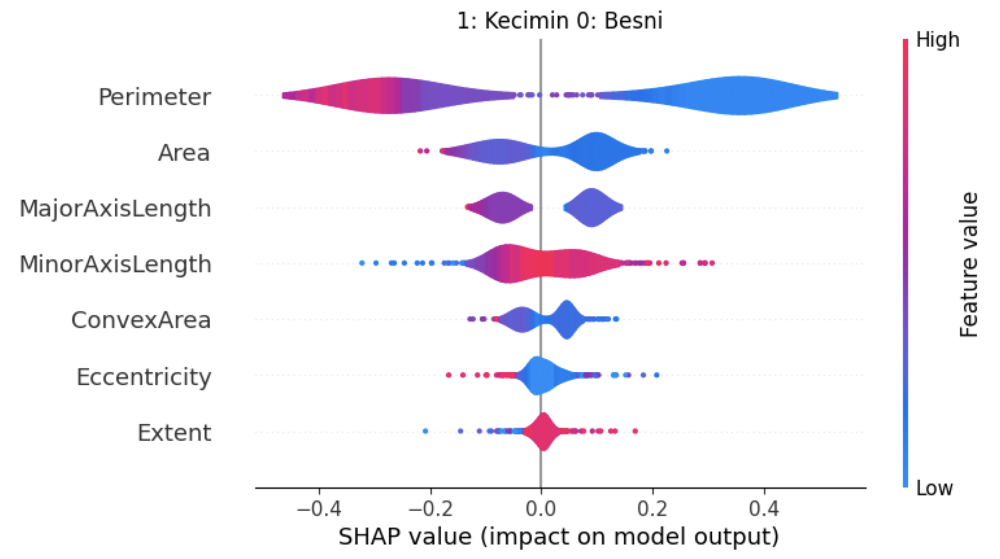

<div align="center">
  
  
  # 🍇 Raisin awareness of currant affairs
  
  A machine learning project for classifying raisins using logistic regression implemented from scratch with NumPy
  
  [](https://www.python.org/)
  [](https://numpy.org/)
  [](https://fastapi.tiangolo.com/)
  [](https://www.docker.com/)
  
</div>

---

## 📋 Table of Contents

- [Overview](#overview)
- [Features](#features)
- [Project Structure](#project-structure)
- [Installation](#installation)
- [Usage](#usage)
  - [Jupyter Notebook](#jupyter-notebook)
  - [API Deployment](#api-deployment)
- [Model Explainability](#model-explainability)
- [Docker Deployment](#docker-deployment)
- [Dataset](#dataset)
- [Results](#results)

---

## 🎯 Overview

This project demonstrates a complete machine learning pipeline for **raisin classification**. The implementation uses pure NumPy (no scikit-learn) to build a logistic regression classifier from scratch.

The project includes:
- ✅ Custom logistic regression implementation using only NumPy
- ✅ Interactive Jupyter notebook for exploration and training
- ✅ REST API built with FastAPI for serving predictions
- ✅ Docker containerization for easy deployment
- ✅ SHAP analysis for model explainability and feature importance

---

## ✨ Features

### 🧮 Pure NumPy Implementation
- Custom gradient descent optimizer
- Binary cross-entropy loss function
- Sigmoid activation
- No ML framework dependencies (except for SHAP analysis)

### 📊 Interactive Notebook
- Data exploration and visualization
- Performance metrics and evaluation
- Confusion matrix

### 🚀 Production-Ready API
- FastAPI-based REST endpoints
- Input validation with Pydantic
- Prediction endpoint with probability scores

### 🐳 Docker Support
- Docker build
- Optimized image size
- Easy deployment to any cloud platform

### 🔍 Model Explainability
- SHAP (SHapley Additive exPlanations) analysis
- Feature importance visualization
- Individual prediction explanations
- Global model interpretation

---

## 📁 Project Structure

```
fuzzyfun/
├── images/                    # Images and assets for README
├── Dockerfile                 # Docker configuration
├── README.md                  # This file
├── logistic.py                # Class for the logistic regression. Also in the notebook
├── logreg.ipynb               # Jupyter notebook for the model / testing of API and SHAP analysis
├── main.py                    # The  FastAPI app
├── raisin_model.json          # The serialized model settings for loading
├── requirements.txt           # Python dependencies
└── .gitignore                # Git ignore rules
```
---

## 🔧 Installation

### Prerequisites
- Python 3.8 or higher
- pip package manager
- Docker (optional, for containerized deployment)

### Local Setup

1. **Clone the repository**
   ```bash
   git clone https://github.com/daftlad-1983/fuzzyfun.git
   cd fuzzyfun
   ```

2. **Create a virtual environment**
   ```bash
   python -m venv venv
   source venv/bin/activate  # On Windows: venv\Scripts\activate
   ```

3. **Install dependencies**
   ```bash
   pip install -r requirements.txt
   ```

---

## 🚀 Usage

### Jupyter Notebook

The interactive notebook provides a complete walkthrough of the logistic regression implementation:

```bash
jupyter notebook notebooks/logreg.ipynb
```

The notebook covers:
1. **Data Loading & Exploration** - Understanding the raisin dataset
2. **Data Prep** - Preparing features for classification
3. **Model Implementation** - Building logistic regression from scratch
4. **Training** - Gradient descent optimization
5. **Evaluation** - confusion matrix
6. **SHAP Analysis** - Interpreting model predictions

### API Deployment

#### Run Locally

Start the FastAPI server:

```bash
fastapi run main.py --port 80 
```

Access the interactive API documentation at `http://localhost:80/docs`

#### Example API Request

```python

import requests

body = {'Area': [87524, 75166],
 'MajorAxisLength': [442.2460114, 406.690687],
 'MinorAxisLength': [253.291155, 243.0324363],
 'Eccentricity': [0.819738392, 0.801805234],
 'ConvexArea': [90546, 78789],
 'Extent': [0.758650579, 0.68412957],
 'Perimeter': [1184.04, 1121.786]}
 
response = requests.post("http://127.0.0.1/predict/", json=body).json()

{'predictions': [[0.35195471524102434], [0.5189776433759058]],
'q_values': [[-0.007186368228293334, 0.09757694726280954, -0.023958186812480693, 0.4231416366814646, -0.015709027557133555, 1.1067426378437466, 0.06627396602471022],
 [-0.3242171863419545, -0.2090120720145583, -0.2292922188022519, 0.22447639014727822, -0.3042481970320827, -0.28777679036133497, -0.1612524532199187]]}

```

#### Available Endpoints

- `GET /` - Welcome message
- `POST /predict` - Make predictions

## 🐳 Docker Deployment

### Build the Docker Image

```bash
docker build -t raisin-classifier .
```

### Run the Container

```bash
docker run -d --name raisins -p 80:80 raisin-classifier
```

The API will be available at `http://localhost:80`

---

## 📊 Dataset

The project uses a **Raisin Dataset** containing measurements of two varieties of raisins:

### Features
1. **Area** - Number of pixels within the boundaries of the raisin
2. **Perimeter** - Circumference measurement
3. **Major Axis Length** - Length of the main axis
4. **Minor Axis Length** - Length of the perpendicular axis
5. **Eccentricity** - Measure of the elongation
6. **Convex Area** - Number of pixels in the convex hull
7. **Extent** - Ratio of the raisin area to the bounding box area

### Target Variable
- **Class** - Binary classification (Kecimen or Besni variety)

### Data Source
The dataset is publicly available and contains high-quality measurements obtained through computer vision techniques.

---

## 📈 Results

### Model Performance

Confusion matrix with the customer classifier


Confusion matrix with the sklearn classifier for comparison


---

## 🔍 Model Explainability

This project uses **SHAP (SHapley Additive exPlanations)** to explain model predictions:

SHAP helps answer:
- 🎯 Which features most influence the model's decisions?
- 📊 How does each feature contribute to a specific prediction?

### Feature Importance

As we can see, perimeter is  the most important feature. So the lower the perimeter, the more likely it is to be 
class 1, kecimin



---

### Key Findings

- 🎯 **Most Important Features**: Perimeter strongest predictor
- 📊 **Model Complexity**: My GD version of the model works ok
- ⚡ **API deployment**: works ok. Could be deployed on ECS aws for scaling

---


<div align="center">

</div>
